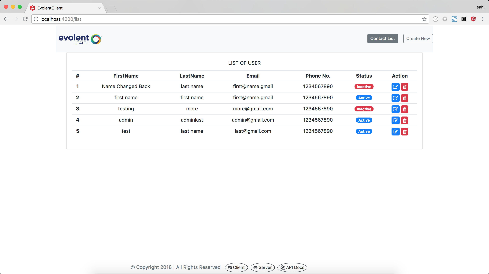
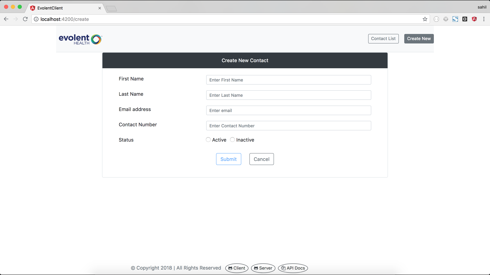

# Evolent Client

## Contact Form Exercise build with technologies.
* Angular 6
* NodeJs
* Mongodb
* Express

Demo of application can be at the [DEMO LINK](https://evolent-exercise.herokuapp.com/);
 `` link https://evolent-exercise.herokuapp.com``

* **Frontend** Project Code  [GitHub Link](https://github.com/meanMonk/evolent-client)
* **backend** Project Code  [GitHub Link](https://github.com/meanMonk/evolent-server)
* **Rest** API Documents  [DOC LINK](https://evolent-exercise.herokuapp.com/api-docs)
  
This project was generated with Angular CLI version 6.1.1.

# To Start development server
>> Run `ng serve` for a dev server. Navigate to `http://localhost:4200/`.

# Running unit tests
>> Run `ng test` to execute the unit tests via [Karma](https://karma-runner.github.io).

# Production build

**__please make sure that you have cloned client project and server project repo in same directory__**

>> Run `ng build --prod` to generate the production. 
The build artifacts will be stored in the `evolent-server/dist/` directory if you have both project in same directory. 

Project Images : 

